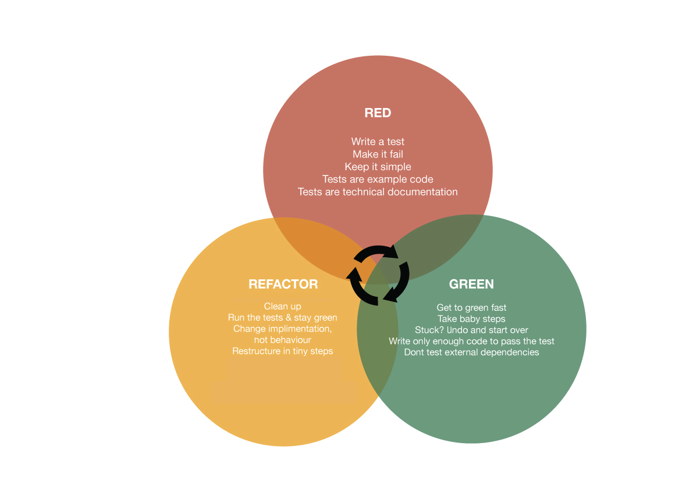
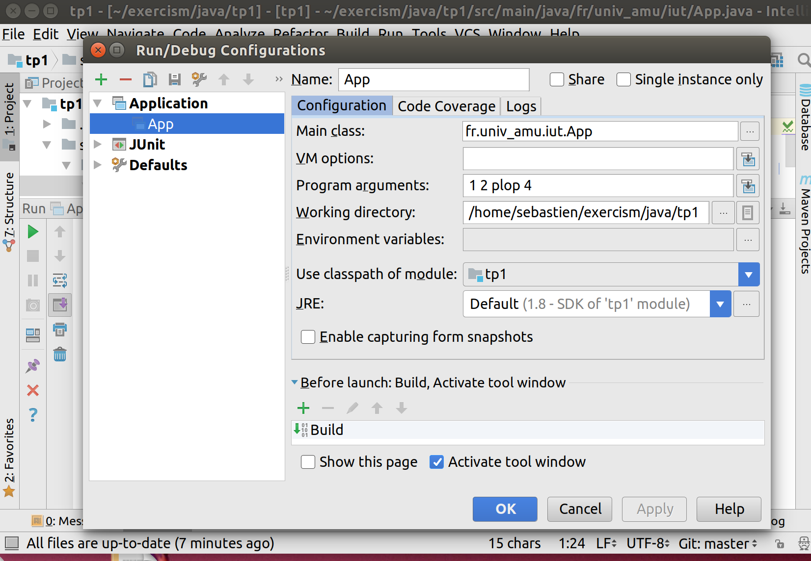

#  Artisanat logiciel et qualité de développement

### IUT d’Aix-Marseille – Département Informatique Aix-en-Provence

* **Ressource:** [R2.03](https://cache.media.enseignementsup-recherche.gouv.fr/file/SPE4-MESRI-17-6-2021/35/5/Annexe_17_INFO_BUT_annee_1_1411355.pdf)
* **Responsables:**
  * [Sébastien Nedjar](mailto:sebastien.nedjar@univ-amu.fr)
  * [Cyril Pain-Barre](mailto:cyril.pain-barre@univ-amu.fr)
* **Besoin d'aide ?**
  * Consulter et/ou créer des [issues](https://github.com/IUTInfoAix-R203/tp1-git/issues).
  * [Email](mailto:sebastien.nedjar@univ-amu.fr) pour une question d'ordre privée, ou pour convenir d'un rendez-vous physique.

## Aperçu du TP et objectifs d'apprentissage

L'objectif premier de ce TP est de vous familiariser avec tous les nouveaux outils qui seront mis en oeuvre pendant ce cours. Ce TP est à la fois une découverte des tests unitaires et de leur mise en pratique en Java. Vous aurez accès également à du matériel plus approfondi et quelques idées pour vous aider à aller plus loin.

Ce TP est une libre adaptation du [TP1 du module M2105](https://github.com/IUTInfoAix-M2105/tp1_19et20).

## TP 2 : Découverte de l'environnement de travail, des outils et premiers programmes en Java [](https://github.com/IUTInfoAix-R203/tp2-tdd/actions/workflows/maven.yml)

### Création de votre fork

Vous connaissez déjà les bases de Git. Si ce n'est pas le cas, il vous faudra réaliser le [TP Git](https://github.com/IUTInfoAix-R203/tp1-git).

Cela vous sera indispensable pour commencer à travailler sur vos TP. Comme vous allez le découvrir le rendu et le suivi de votre travail passeront directement par GitHub.

La première chose à faire est de créer un fork de ce dépôt. Pour ce faire, rendez-vous sur le lien suivant :

[https://classroom.github.com/a/Lr1twuc_](https://classroom.github.com/a/Lr1twuc_)

GitHub va vous créer un dépôt contenant un fork du dépôt 'IUTInfoAix-R203/tp2-tdd' et s'appellant 'IUTInfoAix-R203/tp2-votreUsername'. Vous apparaîtrez automatiquement comme contributeur de ce projet pour y pousser votre travail. Sachez qu'un robot récupérera automatiquement votre code après chaque *push* pour vérifier que les tests passent et calculer votre taux d'accomplissement du TP.

### Découverte et prise en main de l'IDE

Avant de commencer le TP à proprement parler, lisez la page ["Découverte et prise en main de l'IDE"](https://github.com/IUTInfoAix-R203/tp2-tdd/blob/main/decouverte_et_prise_en_main_IDE.md).

### Mode opératoire du TP (Workflow)

Maintenant que vous savez utiliser Git en ligne de commande, que vous avez forké avec le lien classroom et importé le TP dans votre IDE, vous êtes en capacité de travailler sur vos exercices.

Ce TP est conçu pour vous faire découvrir les tests unitaires et le **Test Driven Development (TDD)**, c'est à dire le développement conduit par les tests.

Le TDD est une méthode de conception émergente selon laquelle la conception apparaît au fur et à mesure du développement en encourageant une meilleure compréhension du problème **en commençant à écrire les tests avant le code applicatif**. Pour le développeur, les tests vont constituer une spécification technique exécutable et vérifiable à tout moment. Ainsi en rajoutant des tests, le développeur converge progressivement à la fois vers une spécification plus fine et un code fonctionnel associé.

Le workflow du TDD est souvent décrit par le triptyque "RED, GREEN, REFACTOR" (figure empruntée au site [ministryoftesting](https://www.ministryoftesting.com)) :



Nous vous proposons de suivre ce workflow particulier pour résoudre vos exercices progressivement et en consolidant au fur et à mesure un filet de sécurité qui vérifiera que votre code continue à bien faire ce qu'il doit. Pour vous faciliter la tâche pour ce TP, les tests vous sont donnés pour vous habituer à cette méthodologie sans trop de douleur.

#### Première exécution d'un test

Avant de vous présenter plus précisément ce que vous devez réaliser dans le contexte du TDD, commençons par exécuter un premier test, presque aussi inutile que notre classe `App` car il est censé ne jamais échouer, mais nous permettant de vérifier que les tests sont fonctionnels.

Ouvrez le fichier `AppTest.java`, présent dans `src/test/java/fr/univ_amu/iut`.

Il contient un seul test `testApp()` qui s'assure que `true` est toujours vrai...
La classe `AppTest` devrait être reconnue comme une classe de tests unitaires et apparaître avec l'icône  ajoutant un triangle rouge à celle des classes exécutables.

Pour exécuter ce test, utiliser l'icône vert  (ou comme ici   ou encore , voir ci-après) dans la marge à gauche du code de la méthode, et sélectionner Run 'testApp()'. En bas de la fenêtre devrait s'afficher le résultat du test passé avec succès ayant une marque verte .

Et dans la marge du code de la méthode `testApp()` devrait apparaître l'icône .

Quand une classe de test possède plusieurs méthodes de test, on peut les exécuter tous en cliquant sur l'icône  puis en choisissant d'exécuter la classe entière.

Si un test échoue, son résultat sera écrit en rouge avec le marqueur  et la marge du code de la méthode correspondante aura l'icône . Un double clic sur le test vous ramènera sur son code.

Certains tests peuvent être momentanément désactivés car leur méthode est préfixée de l'annotation `@Disabled`. Dans ce cas, le test est ignoré et apparaît avec la marque . Pour activer le test, il faut mettre en commentaire l'annotation `@Disabled` ou la supprimer.

Enfin, quand il existe plusieurs classes de test regroupées comme ici dans l'arborescence `src/test/java`, il est possible de faire exécuter la totalité de tous les tests (non désactivés) en faisant un clic droit sur le dossier java  et en choisissant Run 'All Tests'...

#### Étapes du cycle principal

Au cours du TP, vous devrez donc opérer en TDD. Chaque exercice sera accompagné d'au moins une classe de test, dont tous les tests sont initialement désactivés. Pour réaliser l'exercice vous devrez suivre cycliquement les étapes suivantes (indiquées dans la figure précédente, illustrant le TDD) :

1. **RED :** Dans cette étape, vous devez activer un test en enlevant le `@Disabled` devant la méthode de test (ou en la décommentant). Une fois le test activé, vous devez le lancer pour vérifier qu'il échoue. Un test qui n'échoue jamais (comme celui de `AppTest`) ne teste rien donc il ne sert à rien.

1. **GREEN :** Ici vous devez écrire le moins de code possible pour faire passer le test en question. Quand vous pensez avoir terminé, vous relancez le test en question pour vérifier que le code est juste. Si tel est le cas, vous lancez tous les autres tests pour vous assurer que votre implémentation n'a rien cassé.

1. **REFACTOR :** Maintenant que votre couverture de test est au vert, vous pouvez transformer votre code pour le nettoyer, le restructurer et l'améliorer sans en changer le comportement. Pendant cette étape, les tests doivent être continuellement au vert. Ils jouent le rôle de filet de sécurité pour éviter l'introduction d'une régression dans le code. Quand tout est terminé vous pouvez redémarrer le cycle avec un prochain test.

**À chaque fin de cycle**, vous devez commiter votre travail sur votre dépôt Git local et le pousser sur votre fork sur GitHub. Vous terminez un exercice lorsque tous les tests y sont activés et passent sur votre dépôt distant.

### Exercice 1 : Hello world

Exercice d'introduction classique. Dites simplement "Hello world!"

"Hello world" est le premier programme que l'on écrit pour commencer la programmation dans un nouveau langage.

On considérera la résolution d'un exercice comme l'implementation d'une fonctionnalité. L'ensemble des modification devra donc avoir lieu dans une branche de fonctionnalité appelée `exercice1`. Pour la créer, vous devez exécuter les commandes suivantes :

```sh
~/.../tp2-VotreUsername (main)$ git branch exercice1
~/.../tp2-VotreUsername (main)$ git checkout exercice1
~/.../tp2-VotreUsername (exercice1)$ 
```

**Les objectifs sont simples:**

* Vous devez activer les tests un par un.
* Commencez par le premier, lancez-le, il doit échouer. Implémentez ensuite la fonction de façon à ce qu'elle retourne `null`.
* Faites à nouveau tourner le test, il doit encore échouer. Puis implémentez la fonction pour qu'elle retourne "Hello, World!".
* Faites à nouveau tourner le test, il doit réussir.
* Vous recommencez ensuite ce travail pour chacun des tests suivants.
* Poussez votre solution sur GitHub.
* Si vous arrivez jusqu'au bout, vous serez prêt à travailler enfin sur votre premier exercice réel.

Bien évidemment l'implémentation qui vous est demandée n'est pas canonique mais elle illustre sur un exemple très simple ce qui vous sera demandé dans la suite des exercices. N'oubliez pas le workflow et surtout de ne passer à l'exercice suivant qu'après avoir activé tous les tests les uns après les autres.

Une fois l'exercice terminé, n'oubliez pas de pousser vos modifications sur votre fork de la manière suivante :

```sh
~/.../tp2-VotreUsername (exercice1*)$ mvn test
~/.../tp2-VotreUsername (exercice1*)$ git add src/test/java/fr/univ_amu/iut/exercice1/HelloWorldTest.java
~/.../tp2-VotreUsername (exercice1*)$ git add src/main/java/fr/univ_amu/iut/exercice1/HelloWorld.java
~/.../tp2-VotreUsername (exercice1*)$ git commit -m "Validation du dernier test de l'exercice 1"
~/.../tp2-VotreUsername (exercice1)$ git push origin exercice1
```

Une fois votre branche `exercice1` poussée sur votre dépôt distant, créez une pull request et invitez votre voisin à en faire la revue. Quand vous aurez terminé de faire les corrections suggérées par votre voisin, vous pourrez fusionner votre PR dans `main`.

Pour continuer à travailler, une fois que vous avez fusionné votre PR, vous devez vous replacer à nouveau sur la branche principale et tirer toutes les modifications de votre dépôt distant :

```sh
~/.../tp2-VotreUsername (exercice1)$ git checkout main
~/.../tp2-VotreUsername (main)$ git pull origin main
```

Après ces commandes, votre branche `main` locale sera enrichie des commits de votre dernière PR.

### Exercice 2 : Fizz Buzz

Le jeu du Fizz Buzz est un jeu sympa à organiser lors d’un anniversaire avec des enfants.

**But du jeu** : Les enfants doivent essayer de remplacer les nombres multiples de trois et cinq respectivement par les mots fizz et buzz : "Fizz" correspond aux multiples de "3" et "Buzz" aux multiples de "5".

**Déroulement du jeu** : Les enfants sont organisés en cercle. Vous désignez un premier enfant qui prononce le chiffre "un" à voix haute. Son voisin de gauche poursuit en prononçant le chiffre "deux". On continue ainsi jusqu’à ce que l’on arrive à un nombre multiple de 3 ou de 5. Le premier piège se situe donc au chiffre 3. L’enfant dont c’est le tour, devra donc dire "fizz" et non "trois".

Voici un exemple de série détaillée jusqu’à 20 :

1 ; 2 ; Fizz ; 4 ; Buzz ; Fizz ; 7 ; 8 ; Fizz ; Buzz ; 11 ; Fizz ; 13 ; 14 ; FizzBuzz ; 16 ; 17 ; Fizz ; 19 ; Buzz ;

Un enfant qui se trompe deux fois est éliminé.

L'objectif de cet exercice est d'implémenter une classe `FizzBuzzer` qui vous permettra de générer toute la série 'FizzBuzz' jusqu'à une valeur passée en paramètre.

Comme pour l'exercice précédent, vous devez activer les tests les uns après les autres et soumettre votre solution après chaque itération du cycle principal du workflow.

Ne pas oublier de créer une branche de fonctionnalité appelée `exercice2` avant de commencer. Pour la créer, vous devez exécuter les commandes suivantes :

```sh
~/.../tp2-VotreUsername (main)$ git branch exercice2
~/.../tp2-VotreUsername (main)$ git checkout exercice2
~/.../tp2-VotreUsername (exercice2)$ 
```

Pas à pas :

* activez le premier test qui appelle la méthode computeString avec la valeur 1 fournie en paramètre, implémentez la méthode en retournant `null`, testez : le test échoue (RED)
* implémentez maintenant la méthode pour qu'elle retourne la chaîne "1", testez : le test réussit (GREEN)
* refaites les deux précédentes étapes avec le second test (RED puis GREEN)
* à ce niveau votre implémentation doit contenir un if, et vous devez remarquer que les deux "return" font la même chose, vous pouvez donc améliorer votre code pour qu'il retourne la chaîne résultat d'une conversion. C'est le premier REFACTOR.
* activez ensuite le test pour 3 (attention pas modulo 3), implémentez avec une valeur de retour fausse (`null`), puis une valeur de retour juste,
* vérifiez que votre code fonctionne en activant le test pour 4,
* activez ensuite le test pour 5 (attention pas modulo 5), implémentez la méthode (un if doit suffire),
* ajoutez maintenant au début de votre méthode la ligne suivante : `if (i==5) return "0";`, constatez et corrigez,
* activez ensuite le test pour 6 (attention pas modulo 3), implémentez avec une valeur de retour fausse, puis une valeur de retour juste,
* à ce niveau vous devez remarquer que vous avez deux fois la même ligne de code (return Fizz). Comme le code ne doit jamais être dupliqué (principe de base en conception), c'est le moment de refactoriser.
* vérifiez que votre code fonctionne en activant le test pour 9,
* activez ensuite le test pour 10, implémentez avec une valeur de retour fausse, puis la valeur de retour juste,
* activez ensuite le test pour 15, qui doit d'abord échouer (sans aucune intervention), et ensuite écrivez le code correct.
* vérifiez pour 0.
* pour l'implémentation de la seconde fonction, conservez le même principe : vous pouvez commenter les lignes 79 à 82 pour continuer à implémenter suivant ce principe incrémental.
* le dernier test est uniquement un test de vérification, vous ne devriez rien avoir à implémenter de plus.

Une fois l'exercice terminé, n'oubliez pas de pousser vos modifications sur votre fork. Créez votre PR, faite la relire par votre voisin et fusionner là dès qu'elle est parfaite. Une fois la fusion effectuée, n'oubliez pas de vous replacer sur la branche `main` et de tirer votre dépôt distant.

### Exercice 3 : Convertisseur de nombre romain

La numération romaine est un système de numération additive utilisé par les Romains de l'Antiquité. Les chiffres romains sont représentés à l'aide de symboles combinés entre eux, notamment par les signes I, V, X, L, C, D et M, représentant respectivement les nombres 1, 5, 10, 50, 100, 500 et 1 000.

Un nombre écrit en chiffres romains se lit de gauche à droite. En première approximation, sa valeur se détermine en faisant la somme des valeurs individuelles de chaque symbole, sauf quand l'un des symboles précède un symbole de valeur supérieure ; dans ce cas, on soustrait la valeur du premier symbole au deuxième.

L'objectif de cet exercice est d'écrire une classe `ConvertisseurDeNombreRomain` qui aura une fonction qui prendra en paramètre un nombre romain et retournera sa représentation en une valeur entière.

**Indications :**

Les nombres romains sont majoritairement représentés selon les principes suivants :

* Un nombre en chiffres romains se lit de gauche à droite ;
* Un même symbole n'est pas employé quatre fois de suite (sauf M) ;
* Tout symbole qui suit un symbole de valeur supérieure ou égale s’ajoute à celui-ci (exemple : 6 s'écrit VI) ;
* Tout symbole qui précède un symbole de valeur supérieure se soustrait à ce dernier ;
  * I doit être retranché à V ou à X quand I est devant V ou X (ex. : 4 s'écrit IV),
  * X doit être retranché à L ou à C quand X est devant L ou C (ex. : 40 s'écrit XL),
  * C doit être retranché à D ou à M quand C est devant D ou M (ex. : 900 s'écrit CM),
  * Par contre, ôter I de L ou de C n'est pas pratiqué (49 s'écrit XLIX et non IL ; 99 s'écrit XCIX et pas IC) ;
* Les symboles sont groupés par ordre décroissant, sauf pour les valeurs à retrancher selon la règle précédente (ex. : 1030 s'écrit MXXX et non XXXM qui est une des façons de représenter 970).

Dans cet exercice, vous allez pour la première fois, manipuler la classe [`String`](https://docs.oracle.com/en/java/javase/11/docs/api/java.base/java/lang/String.html). Cette classe possède de nombreuses méthodes utilitaires pour manipuler facilement les chaines de caractères. Prenez un peu de temps pour survoler la documentation avant de commencer la résolution de cet exercice. Ici, vous utiliserez principalement une boucle `for` et la méthode `charAt(i)` qui retourne le i-ème caractère d'une chaîne.

Faites très attention pour cet exercice de bien respecter le principe du TDD en ajoutant vraiment tout le temps la quantité minimale de code nécessaire à la validation des tests. Si vous suivez cette règle, il se résout très facilement alors qu'en l'abordant de manière générale, il comporte de nombreux pièges pouvant vous faire perdre un temps précieux.

Comme pour l'exercice précédent, vous devez activer les tests les uns après les autres et soumettre votre solution après chaque itération du cycle principal du workflow.

Après le troisième test, vous pouvez refactoriser en utilisant un switch. Ensuite, vous ajouterez les tests nécessaires pour les symboles L, C, D et M.
A la fin de l'implémentation de tous les symboles de base, vous pouvez refactoriser le switch en utilisant l'IDE qui vous propose "Extract method", que vous nommerez correctement, l'idée est de toujours écrire un code facile à relire et qui exprime bien l'intention de l'auteur.

Une fois l'exercice terminé, n'oubliez pas de pousser les modifications de la branche `exercice3` sur votre fork. Créez votre PR, faite la relire par votre voisin et fusionner là dès qu'elle est parfaite. Une fois la fusion effectuée, n'oubliez pas de vous replacer sur la branche `main` et de tirer votre dépôt distant.

### Exercice 4 : Simulateur de robot

L'installation d'essai d'une usine de robots nécessite un programme pour vérifier les mouvements du robot. Les robots ont trois mouvements possibles:

* tourner à droite
* tourner à gauche
* avancer

Les robots sont placés sur une grille hypothétique infinie, face à une direction cardinale particulière (nord, est, sud ou ouest) à des coordonnées {x, y}, par exemple, {3,8}, avec des coordonnées croissantes vers le nord et l'est.

Le robot reçoit alors un certain nombre d'instructions, auquel cas l'installation de tests vérifie la nouvelle position du robot et dans quelle direction il pointe.

La chaîne de caractères "RAALAL" signifie:

* Tournez à droite
* Avance deux fois
* Tournez à gauche
* Avance une fois
* Tournez encore à gauche

Supposons qu'un robot commence à {7, 3} face au nord. Ensuite, s'il exécute la séquence d'instructions ci-dessus il devrait se trouver aux coordonnées {9, 4} face à l'ouest.

**Indications :**

Pour mémoriser l'ensemble des instructions, nous ne pouvons pas connaître à l'avance le nombre d'instructions contenues dans la chaîne de commandes. Les tableaux ne sont donc pas adaptés. Nous allons utiliser un objet d’une classe implémentant l’interface `Collection`, par exemple un `ArrayList`.

L’interface `Collection` est très générale et définit ce qu’une classe collectionnant des objets devrait fournir comme méthodes. Il n’y en a qu’une quinzaine parmi lesquelles :

* `add()` et `addAll()` pour ajouter des éléments
* `clear()`, `remove()`, `removeAll()` et `retainAll()` pour enlever des éléments
* `contains()`, `containsAll()` pour savoir si des éléments sont présents
* `isEmpty()`, `size()` pour connaître le nombre d’éléments
...

Elle est implémentée et étendue par les nombreuses collections spécialisées comme les ensembles (`Set`) qui garantissent qu’un élément est unique dans la collection, les listes (`List`) où les éléments ont des positions, et de nombreuses autres classes et interfaces.

Puisque nous voulons afficher les instructions dans l’ordre de la séquence de commande, nous avons besoin d’une classe qui maintienne cet ordre et qui permette de le suivre lors du parcours. C’est ce qu’impose l’interface `List` qui étend `Collection` notamment ainsi :

* les éléments sont indexés par un entier, le premier élément se trouvant à l’indice 0 ;
* la méthode `get()` est introduite et permet d’obtenir l’élément se trouvant à une position donnée ;
* les méthodes `add()` et `addAll()` ajoutent les éléments en fin de liste ou à une position donnée.

Nous avons tous les ingrédients pour résoudre notre problème. Il ne manque plus qu’à choisir une classe parmi celles implémentant `List`... Dans les exercices qui suivent, nous choisirons `ArrayList`.

**Travail à faire :**

* Écrire une classe `Robot` représentant le robot à simuler.
* Écrire une classe `RobotSimulator` qui permet de passer une chaîne d'instructions à un robot et de piloter le fonctionnement du robot en fonction d'une séquence d'instructions passées en paramètre.
  

Comme pour l'exercice précédent, vous devez activer les tests les uns après les autres et soumettre votre solution après chaque itération du cycle principal du workflow.

Une fois l'exercice terminé, n'oubliez pas de pousser les modifications de la branche de fonctionnalité associée à l'exercice sur votre fork. Créez votre PR, faite la relire par votre voisin et fusionner là dès qu'elle est parfaite. Une fois la fusion effectuée, n'oubliez pas de vous replacer sur la branche `main` et de tirer votre dépôt distant.

### Exercice 5 : Démineur

Le démineur est un jeu de réflexion dont le but est de localiser des mines cachées dans un champ virtuel avec pour seule indication le nombre de mines dans les zones adjacentes.

Le champ de mines est représenté par une grille, qui peut avoir différentes formes : deux ou trois dimensions, pavage rectangulaire ou non, etc.

Chaque case de la grille peut soit cacher une mine, soit être vide. Le but du jeu est de découvrir toutes les cases libres sans faire exploser les mines, c'est-à-dire sans cliquer sur les cases qui les dissimulent.

Lorsque le joueur clique sur une case libre comportant au moins une mine dans l'une de ses cases avoisinantes, un chiffre apparaît, indiquant ce nombre de mines. Si en revanche toutes les cases adjacentes sont vides, une case vide est affichée et la même opération est répétée sur ces cases, et ce jusqu'à ce que la zone vide soit entièrement délimitée par des chiffres. En comparant les différentes informations récoltées, le joueur peut ainsi progresser dans le déminage du terrain. S'il se trompe et clique sur une mine, il a perdu.

#### Description du problème

Dans cet exercice, vous devez écrire le code qui compte le nombre de mines adjacentes à une case et transforme des tableaux comme celui-ci (où * indique une mine):

```
+-----+
| * * |
|  *  |
|  *  |
|     |
+-----+
```

En ceci :

```
+-----+
|1*3*1|
|13*31|
| 2*2 |
| 111 |
+-----+
```

**Travail à faire :**

* Écrire la classe `MinesweeperBoard` qui pour un tableau d'entrée avec les mines vous permettent de calculer le tableau avec les nombres.

Comme pour l'exercice précédent, vous devez activer les tests les uns après les autres et commiter votre solution après chaque itération du cycle principal du workflow.

Une fois l'exercice terminé, n'oubliez pas de pousser les modifications de la branche de fonctionnalité associée à l'exercice sur votre fork. Créez votre PR, faite la relire par votre voisin et fusionner là dès qu'elle est parfaite. Une fois la fusion effectuée, n'oubliez pas de vous replacer sur la branche `main` et de tirer votre dépôt distant.


### Exercice 6 : Gestion des arguments de la ligne de commande

Cet exercice est présenté dans le livre de Robert C. Martin "Clean Code", chapitre 14. Attention il est beaucoup plus complexe que les précédents. Il pourra être fait que partiellement dans un premier temps.

#### Description du problème

La plupart des développeurs ont dû analyser des arguments en ligne de commande de temps en temps. Si nous ne disposons pas d'un utilitaire pratique, nous parcourons naïvement le tableau de chaînes de caractères (`String[]`) passée en argument de la fonction `main`. Il existe plusieurs utilitaires disponibles, mais ils ne font probablement pas exactement ce que nous voulons. Alors, réinventons la roue et écrivons-en un autre!

Les arguments passés au programme se composent de drapeaux et de valeurs. Les drapeaux doivent être un caractère, précédé d'un signe moins. Chaque drapeau doit avoir zéro, ou une valeur associée.

Vous devrez écrire un analyseur pour ce genre d'arguments. Cet analyseur prend un schéma en précisant les arguments que le programme attend. Le schéma spécifie le nombre et les types de drapeaux et les valeurs que le programme attend.

Une fois que le schéma a été spécifié, le programme doit passer la liste d'arguments réelle à l'analyseur d'arguments. Il vérifiera que les arguments correspondent au schéma. Le programme peut ensuite demander à l'analyseur chacune des valeurs, en utilisant les noms des drapeaux. Les valeurs sont renvoyées avec les types appropriés, comme spécifié dans le schéma.

Par exemple, si le programme doit être appelé avec ces arguments:

```sh
-l -p 8080 -d "/usr/logs"
```

Cela indique un schéma avec 3 drapeaux: l, p, d. Le drapeau "l" (journalisation) n'a pas de valeur associée à celui-ci, c'est un drapeau booléen, Vrai si présent, Faux sinon. Le drapeau "p" (port) a une valeur entière et le drapeau "d" (répertoire) a une valeur de chaîne.

Le code suivant donne un exemple d'utilisation de l'utilitaire que vous écrivez pour la ligne de commande précédente :

```java
public class ArgsMain {
  public static void main(String[] args) {
    try {
      Args arg = new Args("l,p#,d*", args);
      
      boolean logging = arg.getBoolean('l');
      int port = arg.getInt('p');
      String directory = arg.getString('d');
      
      executeApplication(logging, port, directory);
    } catch (ArgsException e) {
      System.out.printf("Argument error: %s\n", e.errorMessage());
    }
  }

  private static void executeApplication(boolean logging, int port, String directory) {
    System.out.printf("logging is %s, port:%d, directory:%s\n",logging, port, directory);
  }
}
```

Si un drapeau mentionné dans le schéma manque dans les arguments, une valeur par défaut appropriée doit être renvoyée. Par exemple "False" pour un boolean, 0 pour un nombre et "" pour une chaîne. Si les arguments donnés ne correspondent pas au schéma, il est important qu'un bon message d'erreur soit donné, expliquant exactement ce qui ne va pas.

Assurez-vous que votre code est extensible, en ce sens qu'il est direct et évident de savoir comment ajouter un nouveaux types de valeurs.

Schema:

* char    - Argument `Boolean`.
* char*   - Argument `String`.
* char#   - Argument`Integer`.
* char##  - Argument `Double`.
* char[*] - Un élément d'un tableau de `String`.

Exemple de schema: (f,s*,n#,a##,p[*])

Ligne de commande correspondante : "-f -s Bob -n 1 -a 3.2 -p e1 -p e2 -p e3

#### Indications

* les arguments de la ligne de commande sont stockés dans le tableau de String figurant dans le profil de la 
méthode `main()` :

```java
    public static void main(String[] args)
```

* Dans le paquetage `fr.univ_amu.iut` la classe `App` contient est une classe exécutable qui affiche sur la sortie standard la valeur de chacun des arguments de passé au programme.

* Pour donner des arguments à une application dans IntelliJ IDEA, il faut passer par le menu `Run->Edit Configurations...`.
  En sélectionnant `App`, vous pouvez spécifier vos arguments dans le champ *Program Arguments*
  



* Regardez bien les différents test pour bien comprendre les schémas.

**Travail à faire :**

* Écrire une classe `Args` qui permettra de manipuler facilement la ligne de commande. Dans un premier temps, inutile d'aller plus loin que le test `testSpacesInFormat`.

* Modifiez la classe `App` pour quelle utilise votre classe `Arg` pour gérer la ligne de commande suivant un schéma que vous aurez choisi.

Comme pour l'exercice précédent, vous devez activer les tests les uns après les autres et soumettre votre solution après 
chaque itération du cycle principal du workflow.

Une fois l'exercice terminé, n'oubliez pas de pousser les modifications de la branche de fonctionnalité associée à l'exercice sur votre fork. Créez votre PR, faite la relire par votre voisin et fusionner là dès qu'elle est parfaite. Une fois la fusion effectuée, n'oubliez pas de vous replacer sur la branche `main` et de tirer votre dépôt distant.
