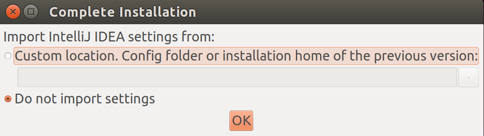

# Découverte et prise en main de l'IDE
Pendant les TP, nous vous recommandons d'utiliser comme environnement de développement intégré **[IntelliJ IDEA](https://www.jetbrains.com/idea/)** de chez **[JetBrains](https://www.jetbrains.com)**. Cet IDE spécialisé dans Java est l'un de ceux qui possèdent la meilleure intégration native d'outils comme Git, GitHub et Maven.

Rien ne vous empêche d'en utiliser un autre mais attention dans ce cas là, vos enseignants attendront une plus grande autonomie vis à vis des problèmes de prise en main de l'IDE.

IntelliJ IDEA possède deux versions, la première dite *'communautaire'* est totalement open source et peut être utilisée gratuitement par n'importe qui et la seconde dite *'ultimate'* qui est plus riche en fonctionnalité et qui n'est pas 
gratuite pour les individus lambda. 

En tant qu'étudiant, vous avez la possibilité de bénéficier d'une licence pour tous les produits JetBrains. Il vous faudra acquérir (gratuitement) une licence étudiant en remplissant [ce formulaire](https://www.jetbrains.com/shop/eform/students).

Quelques minutes après, vous recevrez un email de confirmation suivi d'un second email d'activation ou vous devrez accepter les conditions d'utilisation et choisir un nom d'utilisateur et un mot de passe. Conservez précieusement ces informations dans un coin identifié de votre cerveau car c'est grâce à elle que vous pourrez importer votre licence.
## Lancement et paramétrage de l'IDE

Allez dans le Menu 'Application' puis 'Programmation' et ouvrir 'IntelliJ IDEA Ultimate Edition'. Acceptez la licence et faites votre choix concernant la transmission de données d'utilisation.

<!--
Après le chargement, vous devriez tomber sur une première fenêtre vous proposant d'importer vos paramètres.



Laissez sur 'Do not import settings' et cliquez sur 'OK'. 
-->

À partir de là vous allez personnaliser votre installation 
pour qu'elle corresponde à vos besoins.

Sur la première fenêtre de personnalisation, vous devez choisir l’apparence de votre IDE. Ici rien de fondamental, vous 
pouvez choisir l'option que vous voulez. 


Les deux écrans suivants sont plutôt destinés à une installation sur une machine personnelle. Sur la VM vous pouvez laisser 
les options par défaut et passer à la suite.


Un premier écran permet de choisir des plugins que vous allez activer. De manière générale, il vaut 
mieux en activer le moins possible pour éviter les mauvaises surprises.


Voici la configuration que l'on vous conseille :
- **Java Framworks :** Aucun
- **Build Tools :** Maven
- **JavaScript Development :** Tous
- **Version Controls :** Git et Github
- **Test Tools :** Tous
- **Application Servers :** Aucun
- **Swing :** Activé
- **Android :** Désactivé
- **Database Tools :** Désactivé
- **Other Tools :** Tous
- **Plugin Development :** Désactivé

L'écran qui suit permet d'installer des plugins additionnels.


Aucun ne sera nécessaire (bien que EduTools n'est sûrement pas dénué d'intérêt...).

Il ne reste plus qu'à saisir vos données de connexion pour terminer le paramétrage de votre IDE.


## Import du projet dans l'IDE

Pour pouvoir maintenant travailler sur votre TP, il vous faut cloner votre dépôt GitHub et l'importer dans 
l'IDE.


Pour ce faire cliquez sur 'Get from Version Control' puis sur 'GitHub'. Vous allez arriver sur 
la fenêtre de connexion à GitHub.


Renseignez votre nom d'utilisateur GitHub et votre mot de passe. Cela va générer un token sur votre compte GitHub qui vous authentifiera désormais sur GitHub depuis IntelliJ IDEA. Vous recevrez probablement un mail de la part de GitHub pour vous en informer.


La liste de vos dépôts GitHub devrait appaître. Ici sélectionnez votre fork du TP1 qui devrait avoir un nom de la 
forme 'IUTInfoAix-m2105/tp1-votreUsername'. Mémorisez bien le dossier dans lequel vous clonez votre projet. Vous aurez besoin d'y accéder par la suite en ligne de commande pour soumettre vos changement et les pousser en ligne.

En cas de difficulté à retrouver votre fork du TP, vous pouvez simplement en indiquer l'URL dans la barre du haut. Cette URL est celle obtenue sur le site GitHub du dépôt en cliquant sur 'Clone or download' (le bouton vert à droite) et en choisissant 'Clone with HTTPS'.


Après avoir cliquer sur 'Clone', le clonage du TP1 commence.


*ItelliJ IDEA* devrait détecter que votre projet possède un fichier `pom.xml`, et importer toutes les dépendances du projet. Cela peut prendre un peu de temps. 

## Découverte de l'IDE
Lorsque vous ouvrez votre projet, vous arrivez sur une fenêtre comme celle-ci :


où la vue projet devrait être déjà développée et le (ce !) fichier `README.md` affiché.

Si ce n'est pas le cas, passer la souris sur l’icône représentant une carré en bas à gauche et sélectionnez 'Project' pour avoir la vue de votre projet.

Dans cette vue, vous pouvez voir les différents dossiers de votre projet. Pour le TP, vous travaillerez 
principalement dans deux d'entre eux : 

- `src/main/java/fr/univ_amu/iut/` : Qui contiendra l'ensemble du code applicatif (le code des exercices).
- `src/test/java/fr/univ_amu/iut/` : Qui contient les classes de test associées (le code vous aidant à vérifier votre solution).

Notez qu'IDEA regroupe sur l'interface `fr/univ_amu/iut` en `fr.univ_amu.iut` car les répertoires `fr` et `univ_amu` ne contiennent qu'un seul élément. Vous pouvez utiliser un terminal ou l'explorateur de fichiers du système (nautilus) pour explorer plus en détail l'arborescence de votre projet :

```
~/IdeaProjects$ tree tp1-bashelier/ -I 'target*|resources*'
tp1-bashelier/
├── pom.xml
├── README.md
├── src
│   ├── main
│   │   └── java
│   │       ├── fr
│   │       │   └── univ_amu
│   │       │       └── iut
│   │       │           ├── App.java
│   │       │           ├── exercice1
│   │       │           │   └── HelloWorld.java
│   │       │           ├── exercice2
│   │       │           │   └── FizzBuzzer.java
│   │       │           ├── exercice3
│   │       │           │   └── ConvertisseurDeNombreRomain.java
│   │       │           ├── exercice4
│   │       │           │   ├── GridPosition.java
│   │       │           │   ├── Movement.java
│   │       │           │   ├── Orientation.java
│   │       │           │   ├── Robot.java
│   │       │           │   └── RobotSimulator.java
│   │       │           ├── exercice5
│   │       │           │   └── MinesweeperBoard.java
│   │       │           └── exercice6
│   │       │               ├── ArgsException.java
│   │       │               ├── Args.java
│   │       │               └── ArgsMain.java
│   │       └── module-info.java
│   └── test
│       └── java
│           └── fr
│               └── univ_amu
│                   └── iut
│                       ├── AppTest.java
│                       ├── exercice1
│                       │   └── HelloWorldTest.java
│                       ├── exercice2
│                       │   └── FizzBuzzTest.java
│                       ├── exercice3
│                       │   └── ConvertisseurDeNombreRomainTest.java
│                       ├── exercice4
│                       │   └── RobotTest.java
│                       ├── exercice5
│                       │   └── MinesweeperBoardTest.java
│                       └── exercice6
│                           ├── ArgsExceptionTest.java
│                           └── ArgsTest.java
└── tp1.iml

23 directories, 25 files
```

## Exécution de la classe App

Cette classe principale `App` du package `fr.univ_amu.iut` n'est qu'une classe "témoin" pour s'assurer que tout fonctionne normalement. Ouvrez la dans IDEA et observez son code :

```java
package fr.univ_amu.iut;

/**
 * Hello world!
 *
 */
public class App 
{
    public static void main( String[] args )
    {
        System.out.println("Affichage des arguments de la ligne de commande :");
        for (String arg : args) {
            System.out.println(arg);
        }
    }
}
```

On retrouve :

- l'instruction `package` indiquant à quel package appartient la classe

- l'instruction `public class App` commençant la définition de la classe. Notez que le fichier qui la contient doit avoir le même nom, avec l'extension `.java` ;

- la définition de la méthode **publique** et **statique** `main` prenant en paramètres un tableau de `String` qui en fait une **classe exécutable** (la signature est stricte ; une méthode `main` qui n'aurait pas cette signature ne rendrait pas la classe exécutable). Dans cette méthode :

  - l'instruction `System.out.println()` permet d'afficher un message sur la console en allant à la ligne ;
  
  - la boucle `for` est une boucle de type *foreach* qui permet de parcourir le tableau de `String` en attribuant à la variable `arg` un nouvel élément du tableau à chaque intération ;
  
  - une nouvelle instruction `System.out.println()` qui affiche l'élément courant

En principe, le système et l'IDE sont prêts à fonctionner avec le JDK (Java Development Kit) OpenJDK-11. 
Il ne devrait pas être nécessaire de modifier les paramètres du projet ou d'IDEA pour exécuter la classe principale `App.java` qui devrait apparaître avec l'icône  (icône de classe avec triangle vert) indiquant qu'on peut l'exécuter. Pour ce faire, dans la vue 'Project' effectuez un clic droit sur `App` et choisir Run 'App.main()'.

En bas de la fenêtre, vous devriez voir le résultat de l'exécution de cette classe sur la console d'exécution :


Puisque nous n'avons pas fourni d'argument à l'exécution de la classe, la boucle n'affiche rien. Pour en donner sans passer par la ligne de commandes, il faut passer par le menu 'Run' puis 'Edit Configurations...' (ou clic droit sur la classe et 'Edit App.main()...' pour ouvrir un menu similaire) et saisir les arguments dans la zone 'Program arguments:' :


puis valider. Une nouvelle exécution de `App` affichera sur la console  :

```
Affichage des arguments de la ligne de commande :
zéro
un
deux
trois
quatre
```

## En cas de complications

Il se peut que tout ne se déroule pas comme prévu et que vous ne parveniez pas à exécuter `App`, en particulier si vous utilisez votre propre installation.

Si le triangle vert n'apparaît pas sur le nom de cette classe, il se peut que le projet n'ait pas été correctement importé comme un projet maven (un outil de gestion du cycle de vie d'une application). Dans ce cas faire un clic droit sur le fichier `pom.xml` puis sélectionner 'Maven' puis 'Reimport' (ou 'Import as a maven project').

Si ça ne règle pas le problème, il se peut que IDEA ne trouve pas le JDK (SDK) si l'installation n'a pas été correctement réalisée. Aller dans le menu 'File' puis 'Project Structure' et :
  - dans la partie 'Project SDK' de 'Project Settings', vérifiez que vous utilisez une version de développement java version 11 ou supérieure (le niveau de language est au minimum 8, mais 11 est aussi un bon choix)
  

  - dans la partie 'SDKs' de 'Platform Settings', 11 doit apparaître avec son JDK home path, sinon ajouter manuellement le JDK que vous avez installé :
  
